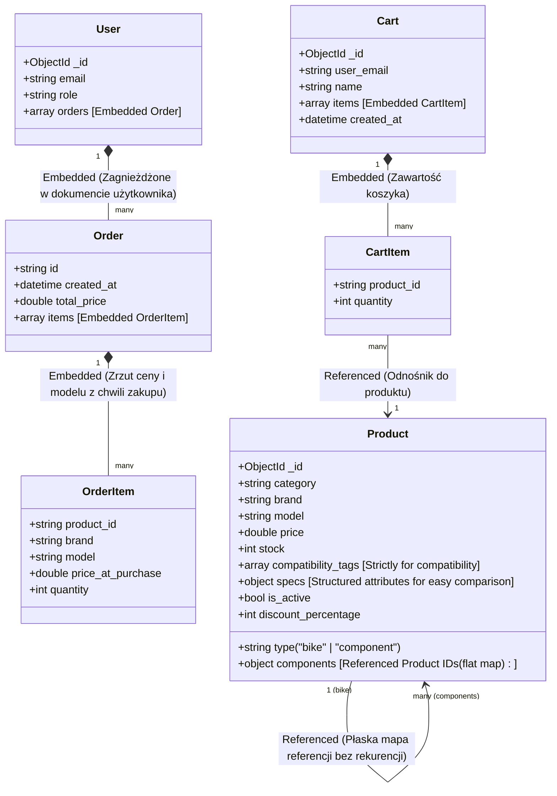

# Diagram Architektury Danych NoSQL (ERD) - Sklep Rowerowy PRO

Poniższy diagram przedstawia relacje oraz strukturę danych w bazie danych MongoDB (NoSQL) dla profesjonalnego sklepu rowerowego. W NoSQL relacje są realizowane hybrydowo: poprzez **osadzanie (Embedding)** dla danych o wysokiej spójności (np. zamówienia w profilu użytkownika) oraz **referencje (References)** dla elementów o dynamicznej strukturze i stanie magazynowym (np. części składowe roweru).

## Opis Wzorców Projektowych

1.  **Osadzenie Zamówień (Embedded Orders)**:
    Zamówienia są osadzone bezpośrednio w kolekcji `users` jako tablica `orders`. Ponieważ zamówienie jest zawsze przypisane do konkretnego użytkownika, pozwala to na błyskawiczny odczyt historii zamówień (jednym zapytaniem do profilu użytkownika) oraz gwarantuje wysoką spójność danych.
2.  **Migawka Pozycji Zamówienia (OrderItem Snapshot)**:
    Każda pozycja zamówienia (`OrderItem`) przechowuje aktualną cenę z chwili zakupu (`price_at_purchase`) oraz model i markę. Chroni to dane przed zmianami cen w katalogu produktów w przyszłości.
3.  **Płaskie Referencje Komponentów (Flat Referenced Components)**:
    Rower (`type: "bike"`) przechowuje słownik `components` zawierający płaskie odnośniki tekstowe `ObjectId` do części składowych w kolekcji `products`. Zapobiega to stosowaniu kosztownej rekurencji podczas pobierania buildów rowerów oraz ułatwia klientom rozbijanie roweru na części.
4.  **Tagi Kompatybilności (Compatibility Tags)**:
    Pole `compatibility_tags` jest wykorzystywane wyłącznie przez system "Smart Cart" do weryfikacji kompatybilności standardów (np. standard mufy suportu `BSA` vs `BB92`).
