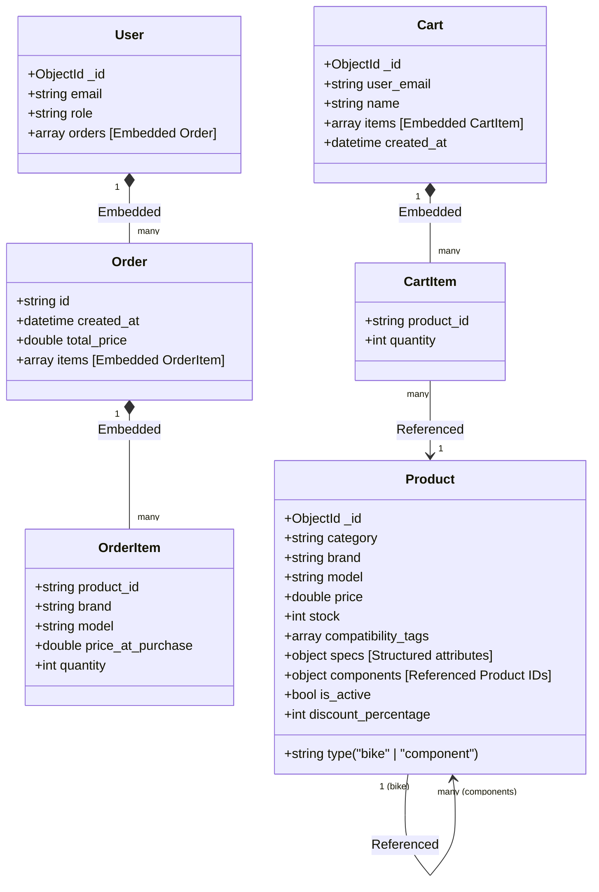

```mermaid
classDiagram
    class User {
        +ObjectId _id
        +string email
        +string role
        +array orders [Embedded Order]
    }

    class Order {
        +string id
        +datetime created_at
        +double total_price
        +array items [Embedded OrderItem]
    }

    class OrderItem {
        +string product_id
        +string brand
        +string model
        +double price_at_purchase
        +int quantity
    }

    class Product {
        +ObjectId _id
        +string type ("bike" | "component")
        +string category
        +string brand
        +string model
        +double price
        +int stock
        +array compatibility_tags
        +object specs [Structured attributes]
        +object components [Referenced Product IDs]
        +bool is_active
        +int discount_percentage
    }

    class Cart {
        +ObjectId _id
        +string user_email
        +string name
        +array items [Embedded CartItem]
        +datetime created_at
    }

    class CartItem {
        +string product_id
        +int quantity
    }

    User "1" *-- "many" Order : Embedded
    Order "1" *-- "many" OrderItem : Embedded
    Cart "1" *-- "many" CartItem : Embedded
    CartItem "many" --> "1" Product : Referenced
    Product "1 (bike)" --> "many (components)" Product : Referenced
```
